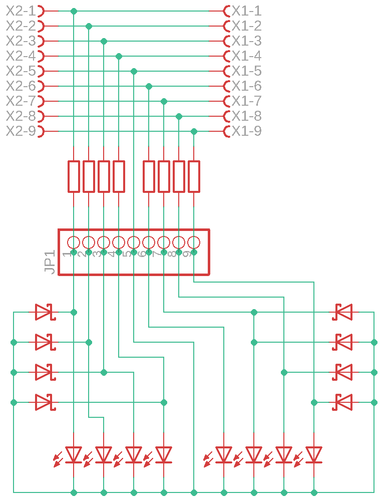

# RS232Debug
Informations how to debug RS232 Hardware Flow Control

# Why?
I had troubles to work with my old Pen Plotter and then i tried to fix it.

# How?
I build a "Hardware Sniffer" and connect it to a Logic Analyzer.
A cheap Logic Analyzer like the cheap 10 Dollar ones with 8 Channel and 24MHz are more then enough.
The Hardware Sniffer Board is not only a connector but also a Voltage Translator. So RS232 can be up to +-9V per Channel you must limit it to the Range of the LA with 0 to 5V. So the Cheap LAs are ready to analyze 3,3V Signals it can be very solved with LEDs. If you use Red Ones you Limit the Voltage arround 3,2V - if you want more you can put a normal Diode in Series. You can also use Z-Diodes - then you are done. If you use LEDs like me then you need a second Diode for each Cannel to limit negative Voltages. Those should be Shotky types to limit it to -0.5V. So this is more complex but you can see on the LEDs whats actual happen on the Lines. I tried it to draw it like my soldering on my PCB. I have aditionally add some Jumpers: this is up to you if you install it. I never used them ;)

Then you need to connect the Pinheader to the LA. Be careful: Pin 1 to 1 and so on - till Pin 5 on the Sniffer: This is GND (Pin9 on LA). Then continue with Pin 5 to Pin 4 and so on.
After this you can set your Logic Analyzer Software to the Line Names: DCD, RX, TX, DTR, DSR, RTS, CTS and RI. I also set some Glitch filter inside the LA Software (50µs per channels), add a 9,6kBaud Packet Analyzer on TX and Trigger to TX. I also Capture 100s with 5GB Memory.

What do we see? The Plotter sends his Buffer full on Line DSR and not like excepted on Line CTS.

So i Swap the connections inside my Cable and try again. Now i see after CTS Changes TX stops - fine, thats it!
Here i use Channel 7 / Pin 8 on LA behind the Reciver to check if CTS really reaches the PIs Pinheader. Yes i don't look on RI on my Sniffer Board but this is ok: The plotter Cable doen't connect it :)

Debug can be easy - it looks complex but it isn't. So lets give it a try.

# Some hints for RS232 on Raspi Pi

I use for my tests a Waveshare RS232 Board with CTS and RTS. Then you need a Dsub9 Male to Male Connector with crossed RX and TX or you change the Connector on the Device cable - but then you are not more compliant to PC Stuff and maybe also to your Sniffer. I put in a selfbuild adaptor - so its easy to change while debug it. After all i end up with a small SP3232 Board from Asia hooked between a pinheader to my Raspi and a DSub9 Male inside the Raspi Case. If everything works tells you the LA :)

